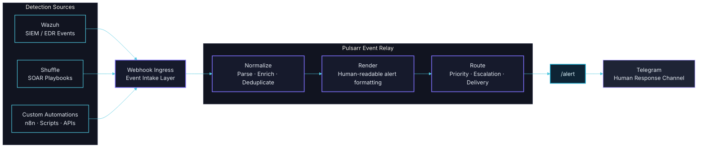

# Pulsarr

<p align="center">
  
</p>

Pulsarr is a real-time event relay for security teams, routing alerts from systems like Wazuh and Shuffle into human response channels.

Detect. Route. Respond.

[](https://www.python.org/)
[](https://flask.palletsprojects.com/)
[](https://core.telegram.org/bots/api)
[](#architecture-flow)
[](https://wazuh.com/)
[](https://shuffler.io/)
[](#roadmap-direction)

## Brand Note

The attack happened. The log exists. The question is whether it reached the right human in time.

Pulsarr is not a SIEM.
Pulsarr is not a compliance platform.
Pulsarr is the relay.
The channel between your infrastructure and the humans defending it.

## What Pulsarr Is

- A webhook-driven alert routing service.
- A normalization and rendering layer for incident payloads.
- A deterministic bridge from detection systems to response channels.
- A backend-first foundation for future multi-destination event routing.

## Current Capabilities

- Receives JSON events via POST to /alert.
- Protects the endpoint with API key validation.
- Normalizes minimum and enriched payload shapes.
- Renders structured, readable Telegram messages.
- Supports HTML-safe output with escaping and truncation for long logs.
- Exposes health endpoint and production-friendly deployment paths.

Telegram is the first destination implemented, not the final one.

## Architecture Flow



Typical deployment today:
Wazuh + Shuffle + custom automations -> Pulsarr /alert -> Telegram human response channel

## Documentation Brand Tokens

These tokens are for docs and visual consistency while the frontend does not exist yet.

- Background: #0A0D14
- Surfaces: #111420, #161A2C, #1E2435, #2A3047
- Brand violet: #7C6FF7
- Violet support: #5548D9, #3D35B0, #A99BFF, #E2DEFF
- Signal cyan: #4FC9E0
- Conceptual type pairing: Inter (UI/headings) and JetBrains Mono (metadata)

## Quick Start

### Option 1: Installer Script

```bash
./install.sh
```

### Option 2: Manual Setup

```bash
python3 -m venv venv
source venv/bin/activate
pip install -r requirements.txt
cp .env.example .env
```

Then set at least these values in .env:

- TELEGRAM_BOT_TOKEN
- TELEGRAM_CHAT_ID
- API_KEY

Run locally:

```bash
./run.sh
```

Health check:

```bash
curl http://localhost:8000/health
```

## API Surface

### POST /alert

Headers:

- Content-Type: application/json
- X-API-Key: your API key (when API_KEY is configured)

Minimum payload:

```json
{
  "message": "SSH auth failures detected"
}
```

Enriched example:

```json
{
  "message": "Multiple SSH authentication failures detected",
  "source": "wazuh",
  "orchestrator": "shuffle",
  "severity": "high",
  "level": 9,
  "rule_id": "5716",
  "agent": "servidor-web-01",
  "agent_ip": "192.168.10.50",
  "target_user": "root",
  "source_ip": "203.0.113.78",
  "source_port": "54321",
  "decoder": "sshd",
  "log_source": "/var/log/auth.log",
  "full_log": "May 15 14:32:18 servidor-web-01 sshd[12345]: Failed password for root from 203.0.113.78 port 54321 ssh2",
  "event_type": "SSH authentication failure",
  "affected_endpoint": "/ssh",
  "workflow": "telegram-test"
}
```

## Integration Example (Wazuh + Shuffle)

```bash
curl -X POST http://localhost:8000/alert \
  -H "Content-Type: application/json" \
  -H "X-API-Key: your-api-key" \
  -d '{
    "message": "Multiple SSH authentication failures detected",
    "source": "wazuh",
    "orchestrator": "shuffle",
    "severity": "high",
    "rule_id": "5716",
    "agent": "servidor-web-01"
  }'
```

## Environment Variables

Required:

- TELEGRAM_BOT_TOKEN
- TELEGRAM_CHAT_ID

Recommended:

- API_KEY

Operational:

- HOST (default 0.0.0.0)
- PORT (default 8000)
- LOG_LEVEL (default INFO)
- INCLUDE_RAW_JSON (default false)
- TELEGRAM_PARSE_MODE (kept for compatibility)
- GUNICORN_WORKERS (default 3)

## Deployment Notes

- Systemd unit file is currently named systemd/telegram-alert-sender.service for compatibility with existing setups.
- Docker Compose currently keeps a compatibility service key name.
- Operational names can be migrated in a dedicated deployment migration step later.

## Roadmap Direction

- Configurable sources (beyond current webhook conventions)
- Mapping engine for source-specific normalization
- Template editor for destination-specific rendering
- Multiple destinations (Telegram first, then Slack/Teams/email/webhooks)
- Frontend/admin panel for route management and observability

## Security and Operations

- Use strong API keys and rotate them.
- Keep .env out of version control.
- Restrict source IPs when possible.
- Prefer reverse-proxy TLS termination in production.

## License

MIT. See LICENSE.
